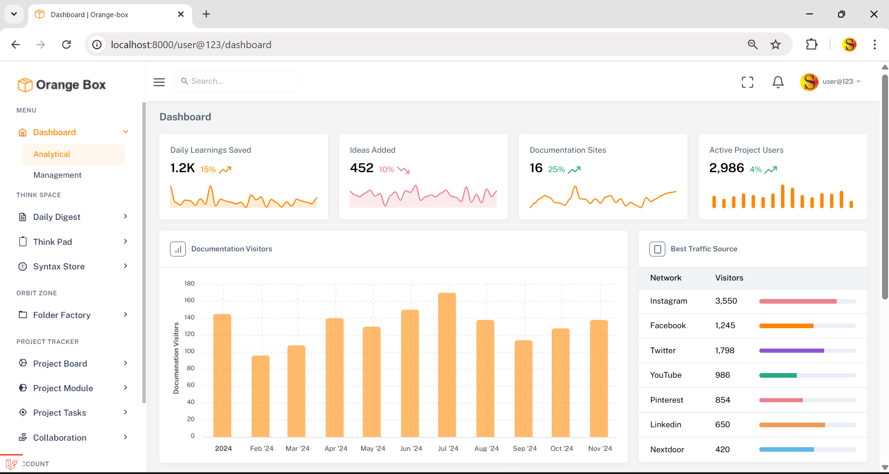
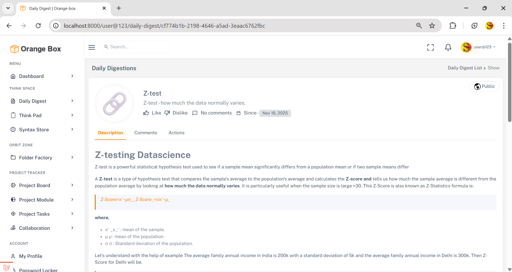
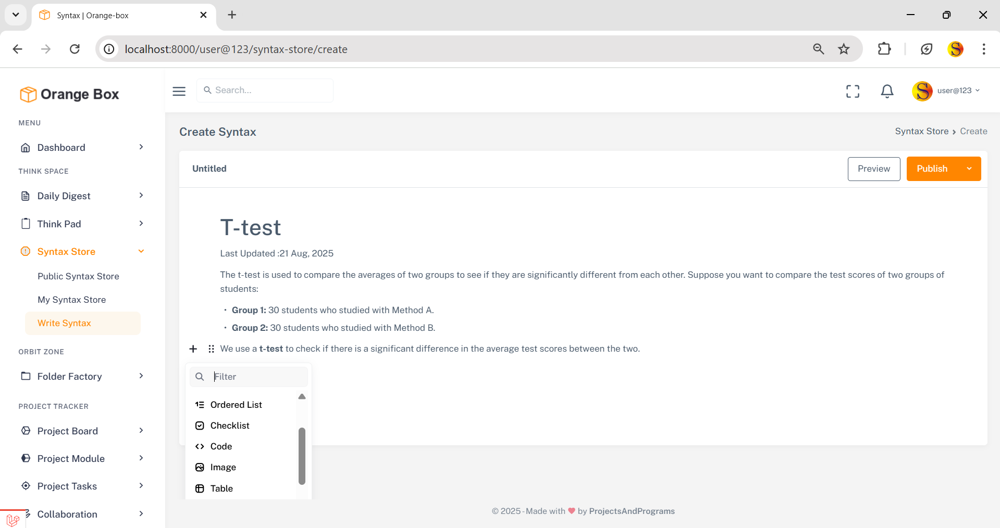
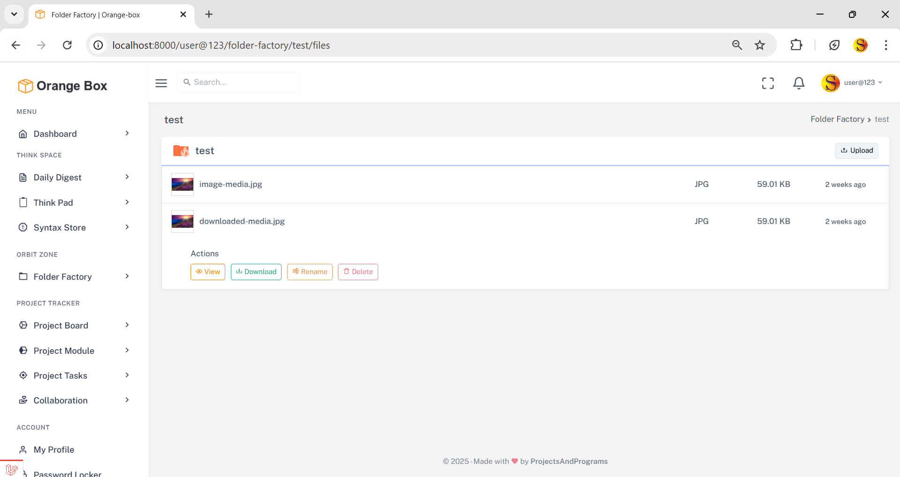
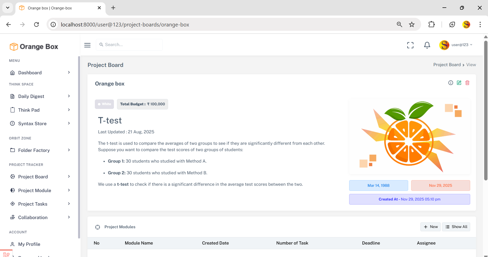
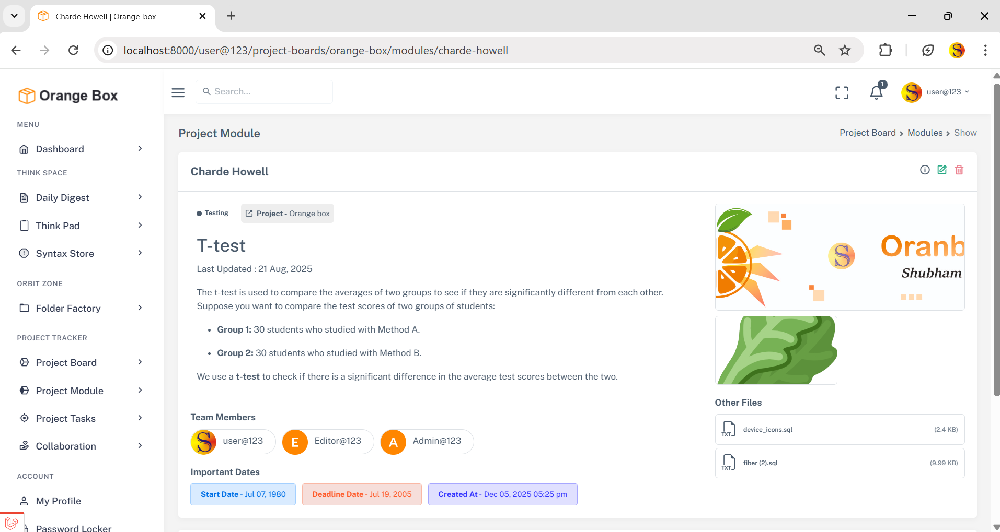
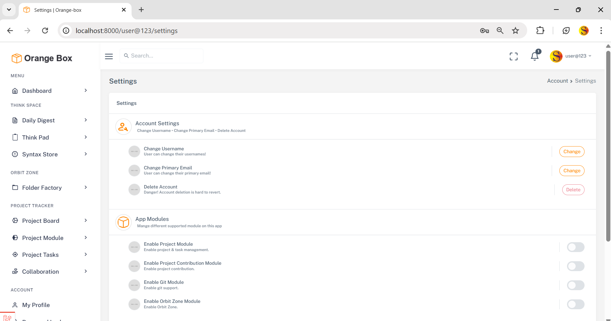

<p align="center"><a href="https://laravel.com" target="_blank">
<picture>
  <source media="(prefers-color-scheme: dark)" srcset="./public/assets/images/logo-light.svg">
  <source media="(prefers-color-scheme: light)" srcset="./public/assets/images/logo-dark.svg">
  
</picture> 
</a>
</p>


## Orange-box
An Content Management system 

- After changing anything on helpers.php file run this to see updates
```sh
composer dump-autoload
```


### Key Feature 

- Digestions
- Think pad
- syntax store 
- folder factory 
- project management
- collaboration work on project
- password locker
- Personal Portfolio
- Notification
   - Task assigned - creation, update ----------------------------------------- DONE
   - Module Member Selection - create - update -------------------------------- DONE
   - task completed by member - to owner -------------------------------------- DONE
   - Comment Generated -------------------------------------------------------- DONE
   - Reply on comment --------------------------------------------------------- DONE
   - someone visited to your - unlisted stuff --------------------------------- half done
- Settings
    - notifications
        - all notification
        - Task notifications
        - Module Notification
        - Comment Notification
        - unlisted notification
    - create passwords 
        - masterkey
        - lockscreen
        - pemkey
        - changepassword
        - authenticator_app
    - theme
        - theme color
        - theme bg color
        - sidebar color
    - enable-project-management
    - account settings
        - change username
        - change primary email
        - delete account
        - recovery email
-     

### Screenshots


<div style="display: flex;flex-direction: column; grid-gap: 10px;">
     <div style="display: flex; grid-gap: 10px;">
        
        
    </div>
</div>
<div style="display: flex;flex-direction: column; grid-gap: 10px;">
     <div style="display: flex; grid-gap: 10px;">
        
        
    </div>
</div>
<div style="display: flex;flex-direction: column; grid-gap: 10px;">
     <div style="display: flex; grid-gap: 10px;">
        
        
    </div>
</div>
<div style="display: flex;flex-direction: column; grid-gap: 10px;">
     <div style="display: flex; grid-gap: 10px;">
        
        <!--  -->
    </div>
</div>


    

## Shoutout Libraries And Framework

<p align="center">
 
 
 
 
 
</p>
